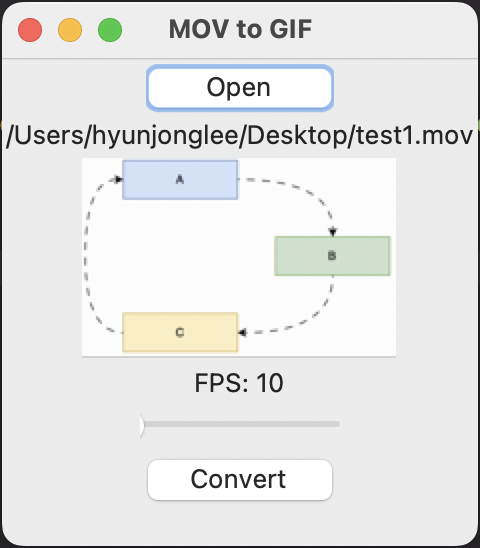
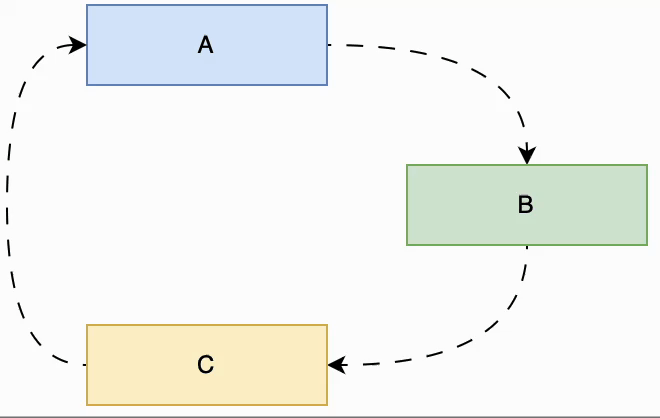

# mov2gif

Simple Python GUI app for converting MOV to GIF

This script is written for only my requirements. This GUI app is for converting MOV video files to GIF image files.

Here is my use case:

    1.	Open the SVG file.
	2.	Record it for a few seconds (⌘+⇧+5).
	3.	Convert it to GIF with this script.

Below is a screen capture of the usage.

Here is the GIF image converted from a MOV file.

Have fun! 😀